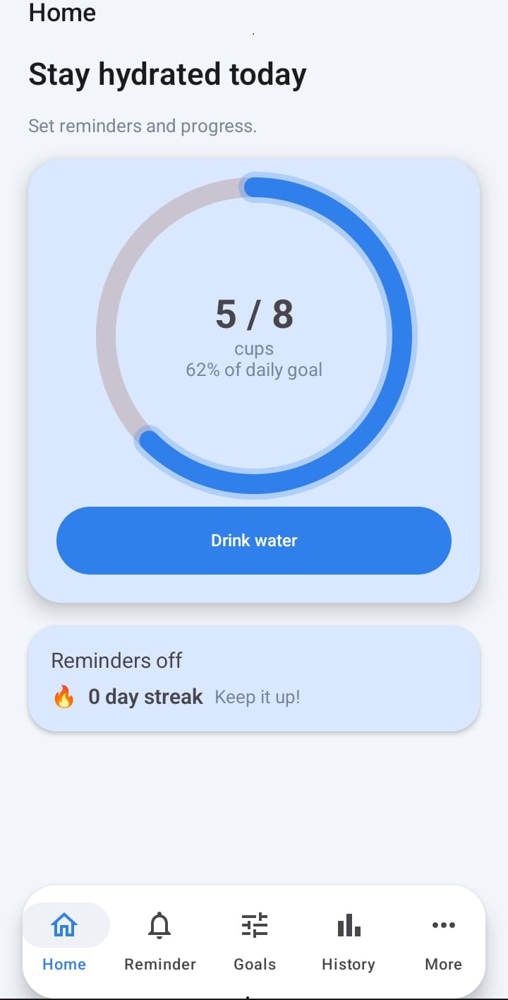
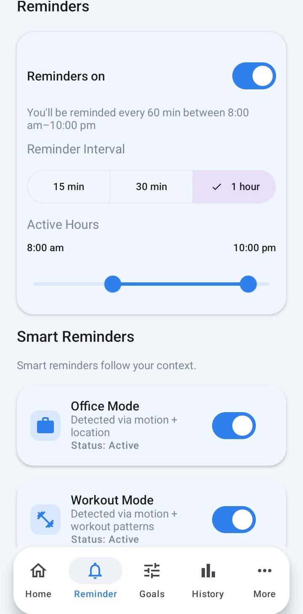
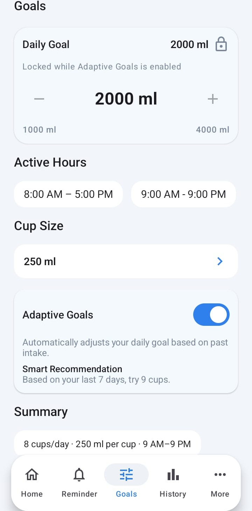
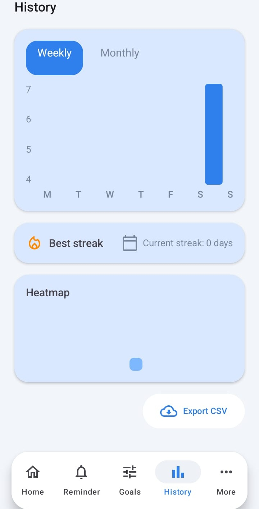
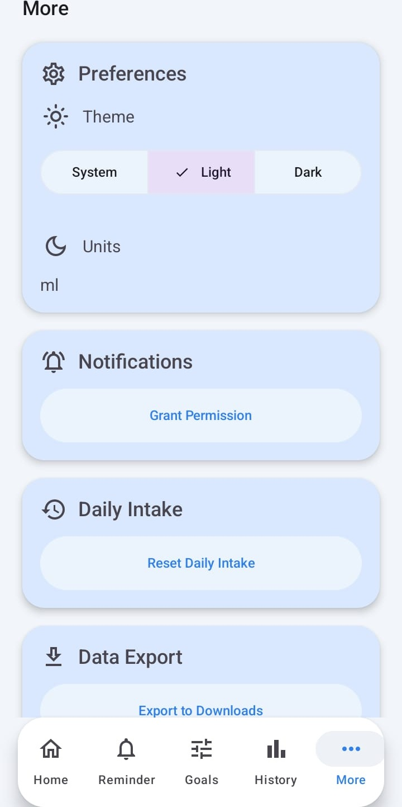

# ROOT README — TEST MARKER

<h1>Water Reminder</h1>

Modern water‑intake tracker for Android with goals, reminders, history, and secure local sync.

<h2>Highlights</h2>
<ul>
  <li>One‑tap water logging with a clean Material 3 UI.</li>
  <li>Smart reminders (office, workout, travel) and active‑hours scheduling.</li>
  <li>Goals, streaks, and weekly/monthly history charts.</li>
  <li>Offline‑first storage with optional HTTPS sync to a local server.</li>
</ul>

<table>
  <tr>
    <th>Home</th>
    <th>Reminders</th>
    <th>Goals</th>
  </tr>
  <tr>
    <td></td>
    <td></td>
    <td></td>
  </tr>
  <tr>
    <th>History</th>
    <th>More</th>
    <th></th>
  </tr>
  <tr>
    <td></td>
    <td></td>
    <td></td>
  </tr>
</table>

<h2>Screens &amp; features</h2>
<ul>
  <li>Home: progress ring, quick log, next reminder.</li>
  <li>Reminders: interval, active hours, smart modes.</li>
  <li>Goals: daily goal, cup size, adaptive insights.</li>
  <li>History: charts, summaries, and streaks.</li>
  <li>Profile: theme selection and preferences.</li>
</ul>

<h2>Tech stack</h2>
<ul>
  <li>Kotlin + Jetpack Compose + Material 3</li>
  <li>Room + DataStore + WorkManager</li>
  <li>Retrofit + OkHttp + Moshi</li>
  <li>FastAPI (optional local server)</li>
</ul>

<h2>Project structure</h2>
<ul>
  <li><a href="app">app</a>: Android application module</li>
  <li><a href="server">server</a>: Optional FastAPI sync server</li>
</ul>

<h2>Quick start (Android)</h2>
<ol>
  <li>Open in Android Studio and sync Gradle.</li>
  <li>Run on an emulator or device.</li>
</ol>

<strong>CLI build (debug APK):</strong> 
<code>gradle -p C:\Users\JHASHANK\Downloads\water_android :app:assembleDebug</code>

<strong>Install APK (adb):</strong> 
<code>adb install -r app/build/outputs/apk/debug/app-debug.apk</code>

<h2>Secure local sync (HTTPS)</h2>
<ol>
  <li>Generate certs: 
    <code>python server/generate_certs.py</code>
  </li>
  <li>Start server: 
    <code>python -m uvicorn server.main:app --host 0.0.0.0 --port 8000 --ssl-keyfile server/certs/server.key --ssl-certfile server/certs/server.crt</code>
  </li>
  <li>Install <code>server/certs/ca.crt</code> on your device as a user CA.</li>
  <li>Base URL:
    <ul>
      <li>Emulator: <code>https://10.0.2.2:8000/</code></li>
      <li>Device: <code>https://&lt;YOUR_PC_IP&gt;:8000/</code></li>
    </ul>
  </li>
</ol>

<h2>Configuration</h2>
<h3>Build‑time</h3>

Set <code>BASE_URL</code> and <code>API_KEY</code> in <a href="app/build.gradle.kts">app/build.gradle.kts</a>.

<h3>Runtime override</h3>

Create <code>/data/data/com.example.waterreminder/files/server_config.json</code>:

<pre><code>{
  "baseUrl": "https://&lt;YOUR_PC_IP&gt;:8000/",
  "apiKey": "dev-key-123"
}
</code></pre>

Push via adb: 
<code>adb push server_config.json /data/data/com.example.waterreminder/files/server_config.json</code>

<h2>API summary</h2>
<ul>
  <li><code>GET /health</code></li>
  <li><code>POST /history</code></li>
  <li><code>POST /device</code></li>
</ul>

<strong>Server writes:</strong>

<ul>
  <li><code>server/data/history.csv</code></li>
  <li><code>server/data/devices.json</code></li>
  <li><code>~/Downloads/water_export_YYYYMMDD_HHmm.csv</code></li>
</ul>

<h2>Troubleshooting</h2>
<ul>
  <li>TLS error “Unable to parse TLS packet header”: server is running HTTP while app uses HTTPS.</li>
  <li>401 Unauthorized: API key mismatch between app and server.</li>
  <li>Sync still failing: verify <code>/health</code> and inspect <code>server/data/history.csv</code>.</li>
</ul>

<h2>License</h2>

MIT (update if different).

# Water_Remainder_Android
# Water_Remainder_Android
